# Streamlit Essentials

Streamlit is a Python library for building interactive data and machine-learning applications without writing a separate frontend. Read these notes before starting the app, then return to the relevant section while you build. The examples follow the [official Streamlit documentation](https://docs.streamlit.io/get-started/fundamentals/main-concepts).

## App Model

A Streamlit app is an ordinary Python script that executes from top to bottom. Everything visible in the browser is produced by that run.

```python
import streamlit as st

name = st.text_input("Your name")
st.write(f"Hello, {name or 'visitor'}!")
```

When the user types a name, Streamlit runs the script again. The widget returns its current value, and the rest of the interface is rebuilt from that value. You therefore write a sequence of Python statements instead of frontend callbacks.

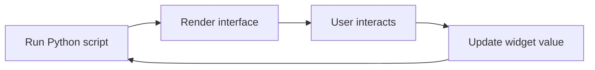

## Client-Server Architecture

The browser displays the interface, but the Python code, data loading, and model inference run on the Streamlit server. During local development both roles happen on your computer; after deployment, the browser and server may be on different machines.

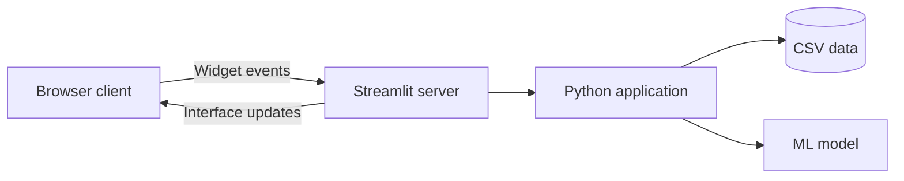

This distinction explains why an app cannot read arbitrary files from a user's computer. Files must already exist on the server or be deliberately transferred through a component such as `st.file_uploader`. See the [official client-server architecture guide](https://docs.streamlit.io/develop/concepts/architecture/architecture).

## Development Flow

Keep the application process running while you edit:

```bash
uv run streamlit run app.py
```

Save the source file, let Streamlit rerun it, and inspect the result in the browser. Select **Always rerun** when prompted so this feedback loop stays automatic.

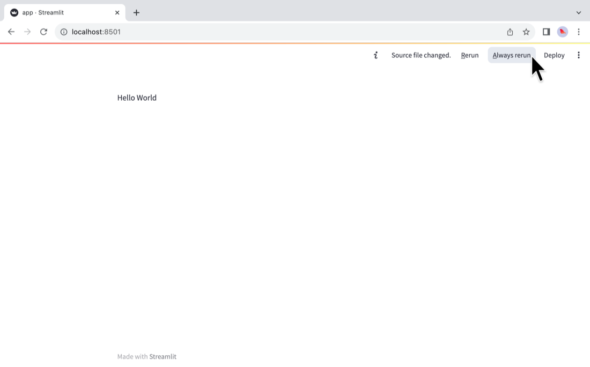

*Source: [Streamlit Docs, Always rerun screenshot](https://github.com/streamlit/docs/blob/main/public/images/get-started/hello-world-6-always-rerun.png), Apache 2.0.*

## Data Flow

A rerun re-executes every line, including expensive work, unless you deliberately preserve or cache the result.

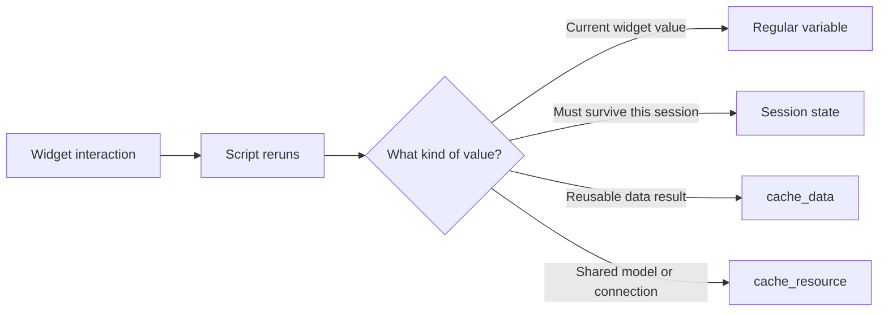

Use regular variables for values that can be recreated cheaply. Use session state for values that belong to one user's interaction, and caching for expensive results that can be reused.

## Displaying Data

Choose the most specific display command for the experience you want:

- `st.write` handles text, dataframes, charts, and many Python objects.
- `st.dataframe` provides an interactive table with sorting and exploration.
- `st.table` renders a static table.
- `st.plotly_chart` renders an interactive Plotly figure.
- `st.map` quickly plots latitude and longitude columns.

```python
import pandas as pd
import streamlit as st

pokemon = pd.read_csv("data/pokemon.csv")
st.dataframe(pokemon, hide_index=True)
```

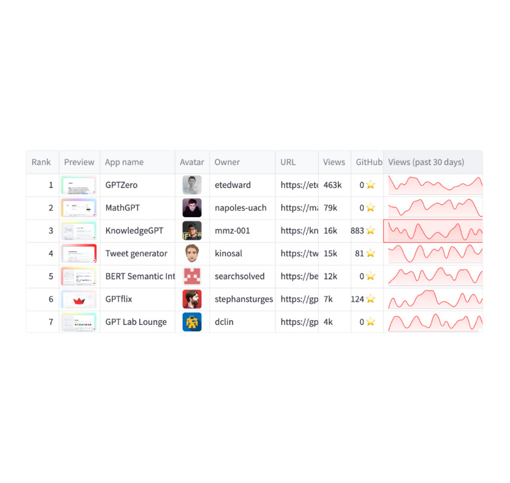

*Source: [Streamlit Docs, st.dataframe screenshot](https://github.com/streamlit/docs/blob/main/public/images/api/dataframe.jpg), Apache 2.0.*

## Widgets

Widgets return ordinary Python values. Select a widget whose constraints match the data you need:

```python
weight = st.slider("Select weight", min_value=0, max_value=1000, step=5)
model = st.selectbox("Select a model", ["LogReg", "Random Forest", "XGBoost"])

if st.button("Run prediction"):
    st.write(f"Using {model} for a weight of {weight} kg")
```

- `st.number_input` and `st.slider` constrain numeric values.
- `st.selectbox` restricts a choice to known options.
- `st.text_input` returns a string and requires your own parsing and validation.
- A button or form prevents expensive work from running after every keystroke.

## Forms and Widget Execution

Outside a form, changing a widget sends its value to the Python backend and triggers a rerun. A form batches several widget values and sends them together only when the user submits it.

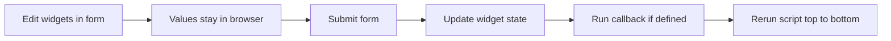

```python
with st.form("prediction_form"):
    attack = st.number_input("Attack", min_value=1, max_value=255)
    defense = st.number_input("Defense", min_value=1, max_value=255)
    submitted = st.form_submit_button("Run prediction")

if submitted:
    st.write("Submitted values:", attack, defense)
```

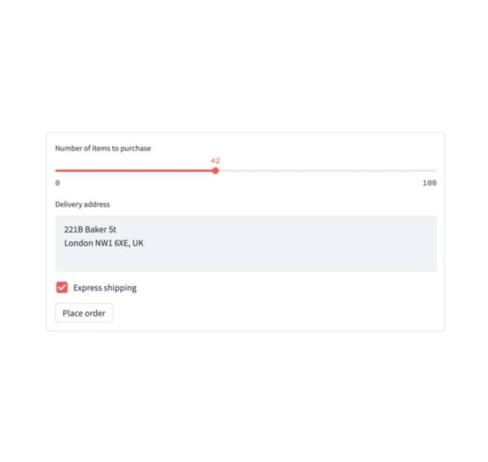

*Source: [Streamlit Docs, st.form screenshot](https://github.com/streamlit/docs/blob/main/public/images/api/form.jpg), Apache 2.0.*

Forms are a good fit for the prediction page because all six statistics describe one request. The model should run after the complete set is submitted, not after each individual field changes.

## Layout

Use layout primitives to create hierarchy, not merely to fill space:

- `st.sidebar` keeps persistent navigation or filters away from the main result.
- `st.columns` places closely related values side by side.
- `st.tabs` separates alternative views of the same subject.
- `st.expander` hides supporting detail until it is needed.

```python
left, right = st.columns(2)

with left:
    st.metric("Pokemon", len(pokemon))

with right:
    st.metric("Types", pokemon["type"].nunique())
```

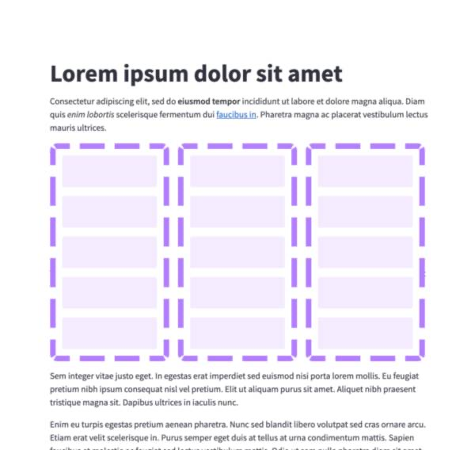

*Source: [Streamlit Docs, st.columns screenshot](https://github.com/streamlit/docs/blob/main/public/images/api/columns.jpg), Apache 2.0.*

## Session State

Local variables disappear at the end of a run. Store values in `st.session_state` when one user's value must survive a rerun or be available on another page.

```python
if "prediction_count" not in st.session_state:
    st.session_state.prediction_count = 0

if st.button("Record prediction"):
    st.session_state.prediction_count += 1

st.write("Predictions this session:", st.session_state.prediction_count)
```

Session state belongs to a browser session. It is useful for interaction history, favourites, form progress, or data shared between pages. It is not a permanent database.

## Caching

Caching prevents expensive work from repeating on every rerun. Choose the decorator according to what the function returns:

- `@st.cache_data` for serializable data such as a dataframe, API response, or aggregation. Each caller receives its own copy.
- `@st.cache_resource` for shared global resources such as a machine-learning model or database connection.

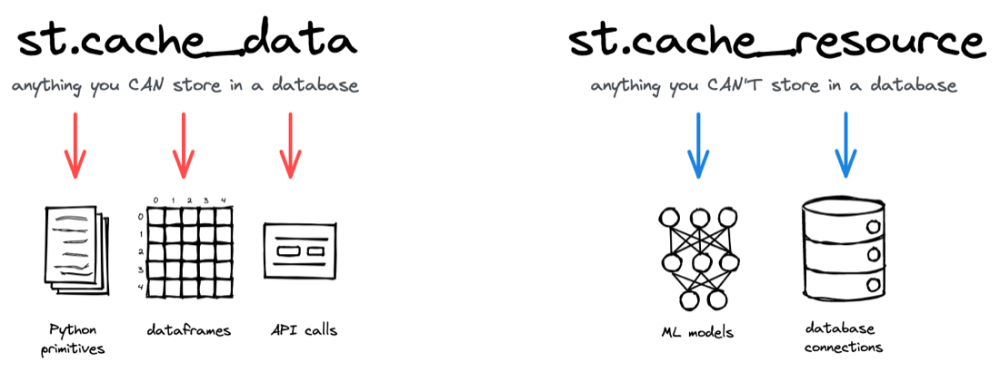

*Source: [Streamlit Docs, caching overview diagram](https://github.com/streamlit/docs/blob/main/public/images/caching-high-level-diagram.png), Apache 2.0.*

```python
@st.cache_data
def load_data():
    return pd.read_csv("data/pokemon.csv")


@st.cache_resource
def load_model():
    with open("models/random_forest.pkl", "rb") as model_file:
        return pickle.load(model_file)
```

In this repository, the CSV is data and the fitted Random Forest is a resource. Cache only trusted values: both Streamlit caching and the provided model helper rely on Python serialization.

## Multipage Apps

Define pages with `st.Page`, register them with `st.navigation`, and call `run` on the selected page:

```python
pages = [
    st.Page("pages/home.py", title="Home", default=True),
    st.Page("pages/eda.py", title="Exploration"),
    st.Page("pages/prediction.py", title="Prediction"),
]

navigation = st.navigation(pages)
navigation.run()
```

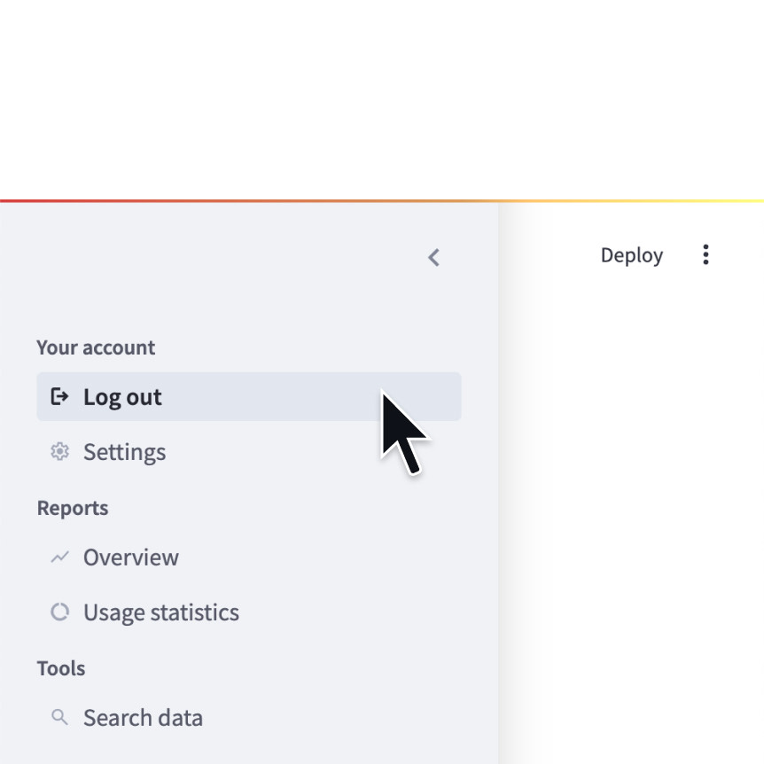

*Source: [Streamlit Docs, st.navigation screenshot](https://github.com/streamlit/docs/blob/main/public/images/api/navigation.jpg), Apache 2.0.*

The entry point runs on every page change, making it a useful place for shared setup. A page that depends on state initialized by `app.py` should be reached through the navigation instead of run directly.

## Progress and Feedback

Communicate what the application is doing:

- `st.spinner` indicates a temporary wait.
- `st.progress` reports measurable progress.
- `st.success`, `st.warning`, and `st.error` explain outcomes.
- Themes affect presentation, but they do not replace a clear information hierarchy.

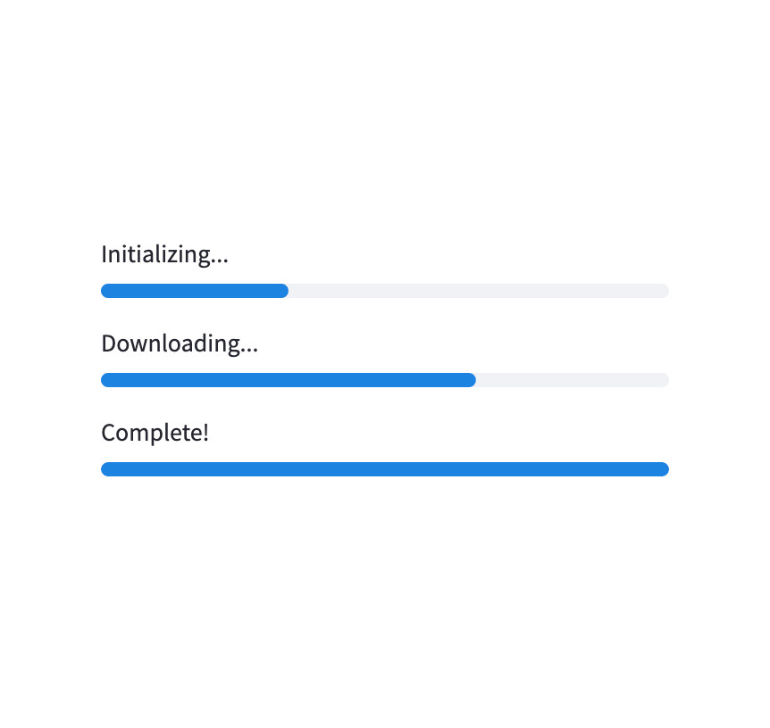

*Source: [Streamlit Docs, st.progress screenshot](https://github.com/streamlit/docs/blob/main/public/images/api/progress.jpg), Apache 2.0.*

Use progress indicators only for real work. A prediction that finishes immediately needs a clear result message, not an artificial loading animation.

## Further Reading

- [Streamlit main concepts](https://docs.streamlit.io/get-started/fundamentals/main-concepts): execution, data display, widgets, and layout
- [Client-server architecture](https://docs.streamlit.io/develop/concepts/architecture/architecture): where Python code, files, and browser interactions live
- [Forms](https://docs.streamlit.io/develop/concepts/architecture/forms): batching widget values into one rerun
- [Multipage apps](https://docs.streamlit.io/develop/concepts/multipage-apps): navigation patterns and page behavior
- [Caching](https://docs.streamlit.io/develop/concepts/architecture/caching): cache behavior, hashing, mutation, and security
- [Session state](https://docs.streamlit.io/develop/concepts/architecture/session-state): values that persist across reruns
- [Widget behavior](https://docs.streamlit.io/develop/concepts/architecture/widget-behavior): identity, order of operations, and cleanup
