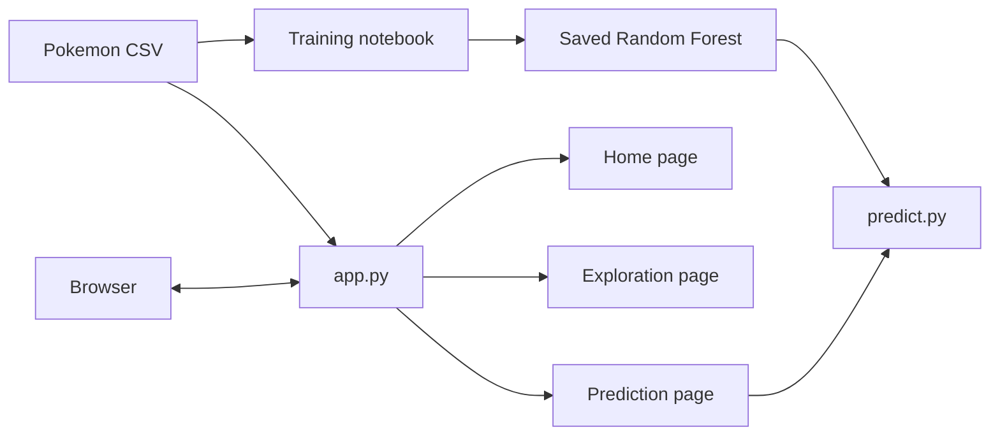
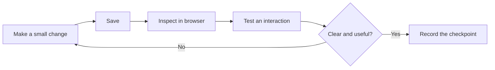
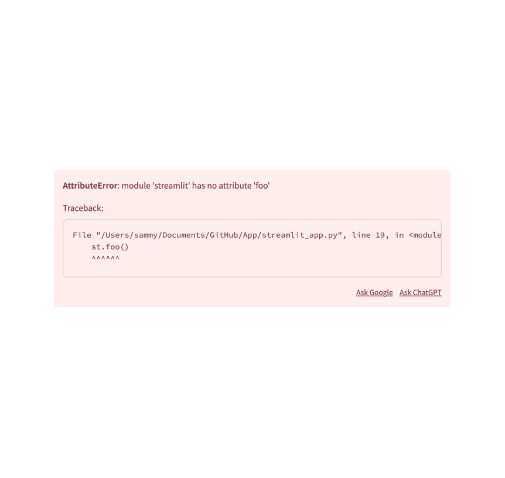

# Build the Streamlit App

Build a small data product that helps someone explore Pokemon and estimate whether a new Pokemon is legendary. The reference implementation uses one visual direction, but your page names, layout, copy, and chart choices can differ as long as the core behavior is present.

Keep the app running while you work:

```bash
uv run streamlit run app.py
```

Use the browser after every small change. A checkpoint is complete only when the visible behavior works, not merely when the script has no syntax error.

## Understand the Application

The notebook prepares a model file. The Streamlit entry point loads shared data and coordinates the pages. Only the prediction page needs the model helper.



Your completed core application should follow this general shape:

```text
.
├── app.py
├── predict.py
├── data/
│   └── pokemon.csv
├── models/
│   └── random_forest.pkl
├── assets/
│   └── ...
└── pages/
    ├── home.py
    ├── eda.py
    └── prediction.py
```

The filenames inside `pages/` can differ, but keep each page focused on one user task.

## Before You Build

1. Run `02-eda-and-modeling.ipynb` from top to bottom.
2. Confirm that `models/random_forest.pkl` exists.
3. Start `app.py` and confirm that the starter page appears.
4. Skim [Streamlit Essentials](01-streamlit-essentials.md), especially the rerun and caching sections.

## Core Application

### 1. Make the Entry Point Yours

Adapt `app.py` to establish the application identity and load shared resources.

- Set a page title and icon with `st.set_page_config` before any other Streamlit command.
- Load `data/pokemon.csv` once and make it available to the other pages.
- Store the six model features from `predict.FEATURE_ORDER` rather than duplicating their names.
- Add navigation for the pages you create in the next steps.

Choose either `st.session_state` or a cached loading function for the dataframe. Be ready to explain why the data should not be read again after every widget interaction.

**Checkpoint:** Refresh the browser. The app has a clear title, navigation appears, and changing pages does not raise a missing-state error.

### 2. Create a Useful Home Page

Create `pages/home.py`. Introduce the purpose of the app using a short title, a local image from `assets/`, and a concise description of what users can do.

Add two or three dataset facts that help a first-time visitor understand the scope. For example, show the number of rows, the number of Pokemon types, or the proportion labelled legendary. Derive these values from the dataframe instead of typing them manually.

**Checkpoint:** The page communicates its purpose without reading the source code, and every displayed number comes from the current dataset.

### 3. Build an Exploration Page

Create `pages/eda.py` and answer at least two meaningful questions about the data. Include:

- an optional view of the raw dataframe;
- one interactive filter or selector;
- one Plotly chart whose labels and hover information are understandable;
- one short interpretation of what the visual shows.

Possible questions include how size relates to speed, how battle statistics vary by type, or which Pokemon have unusual stat profiles. Pick questions that make sense for your own application rather than reproducing every reference chart.

**Checkpoint:** Changing the filter updates the relevant result, the chart remains readable, and the text describes an observation supported by the visible data.

### 4. Connect the Prediction Page

Create `pages/prediction.py` and import `predict` from `predict.py`.

- Collect all six values in `FEATURE_ORDER` with suitable numeric widgets.
- Keep widget ranges plausible for the dataset.
- Group the six inputs in `st.form` and trigger inference with `st.form_submit_button`.
- Show the predicted class and probability with a clear success, warning, or error state.
- Explain that this is a demonstration model and that its probability is not certainty.

Test at least two different inputs. If the page cannot find the model, return to the notebook and verify the generated path rather than changing the path in `predict.py`.

**Checkpoint:** A user can enter valid values, request a prediction, and understand both the result and its limitation.

### 5. Review the Rerun Behavior

Interact with every widget and watch which code reruns. Then check that:

- the dataframe is not reloaded unnecessarily;
- the model is cached as a resource;
- state that must survive a rerun is stored in `st.session_state`;
- a widget change does not accidentally trigger expensive work.

Remove unused imports, dead controls, placeholder downloads, and interface elements that do not perform a real action.

### 6. Polish the Complete Experience

Review the application as a connected product rather than as separate scripts.

- Use consistent page titles, labels, terminology, and number formatting.
- Keep filters close to the content they affect.
- Add instructions only where the next action is not obvious.
- Provide useful empty, loading, success, warning, and error states.
- Check that charts have titles, units, readable legends, and meaningful hover details.
- Avoid relying only on colour to communicate an important distinction.
- Test the app at a narrow browser width as well as on a wide screen.



**Checkpoint:** Another person can complete the main flow without your guidance, and the interface remains coherent after changing pages, filters, and prediction values.

## Core Completion Check

Your core application is complete when:

- it starts with `uv run streamlit run app.py`;
- Home, Exploration, and Prediction pages are reachable;
- the application uses the provided local data and generated model;
- the prediction feature accepts all six expected inputs;
- no visible control is decorative or misleading;
- the app remains usable after several interactions and page changes;
- another person can understand the product without your explanation.

## Diagnose Common Problems

Read the first useful line of an exception before changing code. A traceback identifies where the failure reached your application; it does not automatically prove that the final line contains the root cause.



*Source: [Streamlit Docs, st.exception screenshot](https://github.com/streamlit/docs/blob/main/public/images/api/exception.jpg), Apache 2.0.*

| Symptom | Likely cause | First check |
| --- | --- | --- |
| The prediction page cannot find the model | The notebook was not run, or it wrote to another path | Confirm that `models/random_forest.pkl` exists |
| A page raises a missing session-state key | It was opened directly, or `app.py` did not initialize the value | Enter through the app navigation and inspect the initialization guard |
| A local file is missing | Streamlit was started outside the repository root, or the path is wrong | Check the terminal location and use a repository-relative path |
| A widget change feels slow | Data or a model is recreated on every rerun | Inspect loading functions and their cache decorator |
| Navigation displays the wrong page | The registered path or default page is incorrect | Compare every `st.Page` path with the actual filename |
| A chart does not react to a filter | The filtered dataframe is not passed to the chart | Print or display the filtered rows before building the figure |

After fixing a problem, reproduce the original interaction. A disappearing traceback is not enough if the feature still produces the wrong result.

## Optional Extension Tracks

Complete and polish the core application first. Then choose extensions that deepen one aspect of the product. You do not need to implement every track.

### UX and Product Track

- Let users compare two Pokemon with a radar chart, grouped bars, or a compact metric layout. Keep both on the same scale.
- Add favourites or saved comparisons with session state and a clear reset action.
- Design useful zero-result and invalid-input states.
- Improve chart labels, navigation wording, content hierarchy, and narrow-screen behavior.
- Ask another person to try the app without instructions and revise one confusing interaction.

**Evidence:** Show the original friction, the design change, and the browser behavior that demonstrates the improvement.

### Data and Model Track

- Add a prediction history and export the real submitted values and results as CSV.
- Let users inspect how the predicted probability changes across several examples.
- Add a threshold control and explain how it changes false positives and false negatives.
- Present feature importance as model behavior, not as proof that a feature causes the label.
- Display an evaluation result from the notebook and explain one limitation of that metric.

**Evidence:** Provide at least two contrasting inputs and explain what changed, what stayed constant, and what the model output does not prove.

### Engineering Track

- Compare a quick map built with `st.map` against a configurable Plotly map.
- Handle a missing model file without exposing a raw traceback.
- Validate direct visits, repeated page changes, and unexpected input values.
- Move repeated loading or formatting logic into focused helper functions.
- Add one automated smoke test with Streamlit's `AppTest`.

```python
from streamlit.testing.v1 import AppTest


def test_app_starts_without_an_exception():
    app = AppTest.from_file("app.py").run()
    assert not app.exception
```

If you keep the test in a `tests/` folder, add pytest as a development dependency and run it through `uv`. Continue with the [official Streamlit app-testing guide](https://docs.streamlit.io/develop/concepts/app-testing).

**Evidence:** Show the failure the check would catch, the command used to run it, and the passing result after the fix.

## Final Review and Demonstration

Before presenting the application:

1. Restart it from a clean terminal and confirm the documented command works.
2. Visit every core page through the navigation.
3. Exercise filters with common, boundary, and zero-result values.
4. Submit at least two contrasting prediction cases.
5. Confirm that the interface explains the prediction limitation.
6. Remove controls that still have no real behavior.
7. Capture the Home, Exploration, and Prediction pages.
8. Record one accepted design decision, one rejected idea, and one known limitation.

During the demonstration, start with the user problem and the main flow. Show optional depth only after the core experience works.

## Reflection

Be ready to demonstrate the app and answer these questions:

1. What causes Streamlit to rerun your code?
2. Which resource did you cache, and why did you choose `st.cache_data` or `st.cache_resource`?
3. What belongs in session state in your application?
4. Which part would you redesign before sharing this app with real users?
5. What does the prediction probability communicate, and what does it not prove?

## Reference Implementation

The `solutions/` folder contains one possible implementation, not the only correct design. Consult the matching file after attempting a checkpoint, or run the complete solution with:

```bash
uv run streamlit run solutions/app.py
```

Compare the behavior and reasoning, not only the number of lines or visual appearance.
