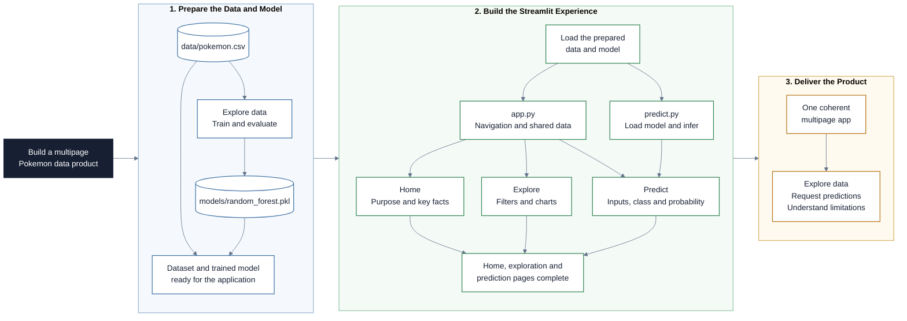

# Learning Streamlit

Streamlit turns a Python script into an interactive web app, so you can share a dataset or a model without writing any HTML, CSS or JavaScript. In this repository, you build a multipage Pokemon app that explores data and serves predictions from a small machine-learning model.

## Project at a Glance

The goal is to turn a dataset and a trained model into a small data product that
another person can explore and use without reading Python code.



## Learning Objectives

By the end of this repository, you should be able to:

- Run a Streamlit app locally and use its automatic reload while you edit the script.
- Build pages that display text, images, dataframes, metrics and interactive charts.
- Collect and validate user input with appropriate widgets.
- Split an app into multiple pages and share data between them with `st.session_state`.
- Cache data and model resources appropriately.
- Serve predictions from a trained scikit-learn model.
- Distinguish a model probability from certainty about a real outcome.

## Learning Path

Skim the essentials, prepare the model in the notebook, then build and extend the app:

| File / Folder                                              | Description                                                                                       |
| ---------------------------------------------------------- | ------------------------------------------------------------------------------------------------- |
| [**Streamlit Essentials**](01-streamlit-essentials.md)     | Reference notes on reruns, widgets, layout, state, caching and multipage apps.                    |
| [**EDA and Modeling**](02-eda-and-modeling.ipynb)          | Explore the Pokemon dataset, evaluate a Random Forest and create the model file used by the app.  |
| [**Build the Streamlit App**](03-build-the-streamlit-app.md) | Guided build with a core application, visible checkpoints and optional extensions.             |
| [**app.py**](app.py)                                       | Minimal working entry point that you develop into your own application.                           |
| [**Pages**](pages/)                                        | Intentionally empty starter folder for the page scripts you create during the workshop.           |
| [**predict.py**](predict.py)                               | Helper that loads the saved model and returns a prediction plus its probability.                  |

### Additional Folders and Files

| File / Folder                        | Description                                                                                         |
| ------------------------------------ | --------------------------------------------------------------------------------------------------- |
| [**Data**](data/)                    | `pokemon.csv`, containing Pokemon characteristics, battle statistics, coordinates and labels.    |
| [**Models**](models/)                | Destination for the model generated by the notebook. The `.pkl` file is not tracked in Git.       |
| [**Assets**](assets/)                | Local teaching illustrations and image assets used by the lessons and app.                          |
| [**Solutions**](solutions/)          | One reference implementation to consult after attempting each checkpoint yourself.                 |
| [**pyproject.toml**](pyproject.toml) | Python 3.13 project configuration and direct dependencies.                                          |
| [**uv.lock**](uv.lock)               | Reproducible dependency lock file.                                                                  |

## Setup

> [!NOTE]
> Throughout these steps, text in angle brackets like `<repo-name>` is a **placeholder**. Replace it including the `< >` brackets with your own value. For example, `cd <repo-name>` becomes `cd learning-streamlit`.

### 1. Create the Repository from the Template

Click **Use this template** on GitHub.

When creating the repository:

- Set yourself as the **Owner**
- Choose a repository name
- Disable **Include all branches**
- Click **Create repository**

> [!IMPORTANT]
> For pair or group work, only one person creates the repository. Add the others under **Settings -> Collaborators**.

---

### 2. Clone the Repository

Copy the SSH URL from the **Code** button on GitHub, then run:

```bash
git clone <copied-ssh-url>
```

The copied SSH URL will look like `git@github.com:<your-username>/<repo-name>.git`.

---

### 3. Move into the Project Folder and Install Dependencies

This installs the locked dependencies and creates a virtual environment in `.venv/`.

```bash
cd <repo-name>
uv sync
```

---

### 4. Train the Model

Launch VS Code in the project root folder:

```bash
code .
```

Open `02-eda-and-modeling.ipynb`, select the environment created by `uv sync` as the notebook kernel, and run all cells from top to bottom. The notebook explores the data, reports a simple holdout evaluation and writes `models/random_forest.pkl`.

> [!IMPORTANT]
> The repository provides the training notebook, not a pre-trained model. Run it before using the prediction page or `predict.py`.

---

### 5. Run the App

```bash
uv run streamlit run app.py
```

The app opens in your browser at `http://localhost:8501`. Leave this command running while you work: Streamlit reruns the app whenever you save a file or interact with a widget.

> [!TIP]
> Arrange your editor and browser side by side. Verify each checkpoint in [Build the Streamlit App](03-build-the-streamlit-app.md) before moving to the next one.

The starter page confirms that the setup works. Build and test a checkpoint before consulting the matching file under `solutions/`. You can run the complete reference app with:

```bash
uv run streamlit run solutions/app.py
```

## References & Further Reading

- [**Streamlit Essentials**](01-streamlit-essentials.md): The reference notes for this session, in one page
- [**Streamlit main concepts**](https://docs.streamlit.io/get-started/fundamentals/main-concepts): How a Streamlit script becomes an app, and how the rerun model works
- [**Streamlit API reference**](https://docs.streamlit.io/develop/api-reference): Every command, grouped by what it does
- [**Multipage apps**](https://docs.streamlit.io/develop/concepts/multipage-apps): Navigation with `st.navigation` and the `pages/` folder
- [**Caching**](https://docs.streamlit.io/develop/concepts/architecture/caching): When to reach for `st.cache_data` and when for `st.cache_resource`
- [**Session state**](https://docs.streamlit.io/develop/concepts/architecture/session-state): Keeping values across reruns and sharing them between pages
- [**Plotly Express**](https://plotly.com/python/plotly-express/): The charting library used for the interactive figures in this app
- [**Streamlit gallery**](https://streamlit.io/gallery): Apps built by the community, useful for seeing what is possible
- [**uv documentation**](https://docs.astral.sh/uv/): The package manager used in this repository

Other Python web frameworks, if you want to compare approaches:

- [**Dash**](https://dash.plotly.com): Dashboards built on Plotly and Flask
- [**Django**](https://www.djangoproject.com): Full-stack framework for larger web applications
- [**Flask**](https://flask.palletsprojects.com/en/stable/): Minimal backend framework
- [**FastAPI**](https://fastapi.tiangolo.com): Backend framework focused on APIs
- [**Taipy**](https://docs.taipy.io): Data and AI apps with a separate core and GUI layer

## License

[MIT license](LICENSE)
